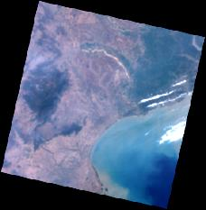
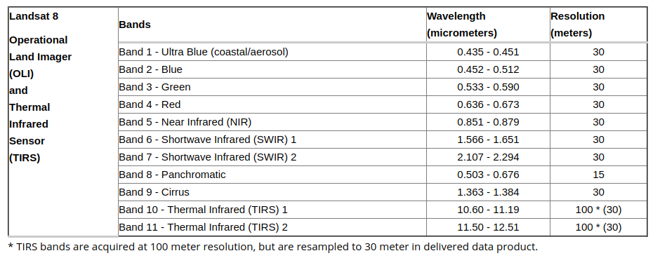

# Satellite Images Processing: Overview

## General view on the data pipeline

Satellite platforms can acquire data with a multitude of sensors. The ones involved in the Challenge are multi-band (or multi-spectral) optical sensors. The data from satellite sensors is provided as _rasters_, that are matrices of georeferenced values. See [visualization example here](https://gist.github.com/ColinTalbert/1bb0634261641f7a239bbb86370d889b).

For an example about how fully processed data displays, you can have a look one of the different public repositories: [Landsat 8 published on AWS](https://aws.amazon.com/public-datasets/landsat/).
The only requirements to access the full dataset is to have a AWS account and create an application token to use with AWS' client `boto3`. The Challenge provides similar data
but provided by Planet and ESA both accessible through the PlanetExplorer Web application or command-line client. This repository requires credentials that will be provided during the project duration.

### Extracting (example): Landsat 8, most popular
Landsat 8 is the best dataset to learn the basics. The [first example in the documentation](https://landsat-pds.s3.amazonaws.com/c1/L8/139/045/LC08_L1TP_139045_20170304_20170316_01_T1/index.html) provides
[this preview](https://landsat-pds.s3.amazonaws.com/c1/L8/139/045/LC08_L1TP_139045_20170304_20170316_01_T1/LC08_L1TP_139045_20170304_20170316_01_T1_thumb_large.jpg). The preview is just a JPEG "thumbnail" of the real deal that are the different bands listed below in the page. To have a general idea of the data, see [paragraph 4.2 and below in this document](https://landsat.usgs.gov/landsat-8-l8-data-users-handbook-section-4).

.

In the "Files" list you can see a list of the available files from the different bands: "BQA" and "B1" to "B10". To know on which section of 
the Electro-Magnetic Spectrum each band has been acquired you can read the [table here](https://landsat.usgs.gov/what-are-band-designations-landsat-satellites):

You can find each of these bands in the "Files" list. You can download the files with the `.TIF` extension, load them into `numpy` and read the full matrices with the given pixel values (BQA is 16bits, others are 8bits). To have the full optical image you need to overlap the Blue, Green and Red bands. The easiest way of visualizing this array in terms of a [picture is using QGIS](https://www.youtube.com/watch?v=ca6SM_HSeaI) or by creating a multi-band image using `GDAL` [command-line](https://gis.stackexchange.com/a/264923/65025).

Every `.TIF` file is in reality a Geo-TIFF, every band-file is georeferenced, in other words you can load it and know the geographical position of every pixel in the image, given its Coordinates Reference System.

You can now probably understand a little better [this notebook full of great examples](https://gist.github.com/sgillies/7e5cd548110a5b4d45ac1a1d93cb17a3).

### Tranforming: ML

Any signal that can be acquired from pixel or pixels-neibourhood level can be translated into counters using Computer Vision techniques (CNN, ...) and translated into metrics. Example of georeferenced metrics per tile:
* number of trees
* number of boat
* quality of roads

Storage of this geo-referenced transformed data can be accomplished with SQL/No-SQL datastores or datawarehouses.

### Load: Data science

Metrics have to be crossed with other sources of data for the same area and insights have to be produced.

## Deliverables

Accurate risk and/or quality predictions/assessments through large amounts of optical data and relative data fusion have to be produced and delivered to the customers using proper channels as a Web UI, but also Jupyter Notebooks or picture slideshows with plotted diagrams.
